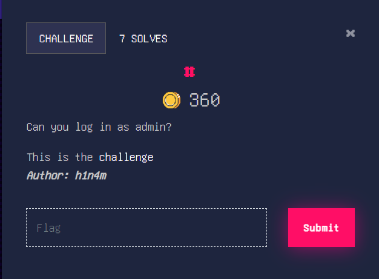
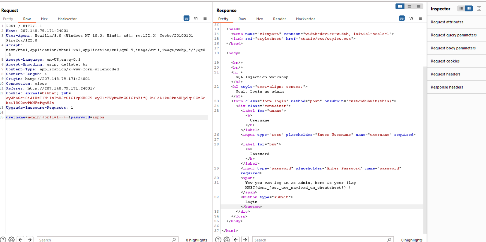

Bài này sqli injection cơ bản thui:<

- ban đầu mình dùng errorbase dums ra được khoảng 10 tên và password trong users với admin-impossible@password
- mà sever filter @ trong password nên mình thử url encode 2 lần cũng không ổn:< dùng cả ssrf:(((

- cuối cùng nó chỉ như thế này:

Flag: MSEC{dont_just_use_payload_on_cheatsheet!}

- Xin loi vi sự ngudot của mình:3